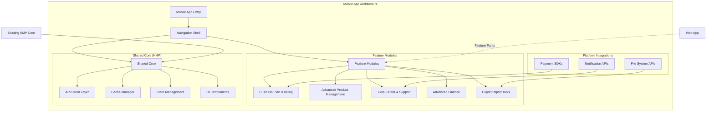

# Design Document: BizGrow Mobile-Web Feature Parity

## Overview

This design specification addresses the critical feature gaps between the BizGrow web application and mobile (Kotlin Multiplatform) application. The analysis reveals that the mobile app currently functions as a companion app for basic operations, while the web platform serves as a comprehensive business management system. The primary goal is to achieve 100% feature parity while maintaining mobile-first UX principles and leveraging the existing KMP shared code architecture.

The design focuses on four core architectural pillars: navigation restructuring to handle complex workflows, UI pattern standardization for consistent user experience, data architecture enhancement to support advanced business features, and modular implementation phases to minimize disruption to existing functionality.

Key business impact includes enabling mobile users to access subscription management (critical for revenue), advanced product management with variants and bulk operations (productivity enhancement), comprehensive help and support systems (user experience), and complex business workflows that currently require web access.

## Architecture

The enhanced mobile architecture maintains the existing KMP foundation while introducing new layers for feature parity. The design leverages the current cleanup efforts in AppViewModel and extends the NavigationManager and FeatureStates pattern to support complex business workflows.



## Components and Interfaces

### Component 1: Enhanced Navigation System

**Purpose**: Handle complex multi-step workflows and deep navigation hierarchies required for advanced business features.

**Interface**:
```kotlin
interface EnhancedNavigationManager {
    fun navigateToWorkflow(workflow: BusinessWorkflow): NavigationResult
    fun navigateWithContext(screen: Screen, context: NavigationContext): NavigationResult
    fun navigateToHelp(feature: FeatureModule, topic: String? = null): NavigationResult
    fun canNavigateBack(): Boolean
    fun getNavigationHistory(): List<NavigationEntry>
    fun clearWorkflowStack(workflowId: String)
}

data class BusinessWorkflow(
    val id: String,
    val steps: List<WorkflowStep>,
    val canSkipSteps: Boolean = false,
    val requiresAuth: Boolean = true
)

data class NavigationContext(
    val parentFeature: FeatureModule,
    val breadcrumbs: List<String>,
    val state: Map<String, Any> = emptyMap()
)
```

**Responsibilities**:
- Manage complex multi-step business workflows (product setup, subscription management)
- Handle deep navigation hierarchies with proper back navigation
- Maintain context across workflow steps
- Integrate with help system for contextual assistance

### Component 2: Business Plan & Billing Module

**Purpose**: Enable mobile users to manage subscriptions, billing, and usage monitoring with full feature parity to web.

**Interface**:
```kotlin
interface BillingManager {
    suspend fun getSubscriptionPlans(): Result<List<SubscriptionPlan>>
    suspend fun getCurrentSubscription(): Result<CurrentSubscription>
    suspend fun upgradePlan(planId: String, paymentMethod: PaymentMethod): Result<BillingResult>
    suspend fun getInvoiceHistory(): Result<List<Invoice>>
    suspend fun getUsageMetrics(): Result<UsageMetrics>
    suspend fun processPayment(payment: PaymentRequest): Result<PaymentResult>
}

data class SubscriptionPlan(
    val id: String,
    val name: String,
    val features: List<FeatureAccess>,
    val limits: UsageLimits,
    val pricing: PricingInfo
)

interface PaymentProcessor {
    suspend fun initializePayment(request: PaymentRequest): Result<PaymentSession>
    suspend fun processNativePayment(session: PaymentSession): Result<PaymentResult>
}
```

**Responsibilities**:
- Native payment integration using platform-specific SDKs (Midtrans, Google Pay, Apple Pay)
- Subscription lifecycle management (upgrade, downgrade, cancellation)
- Usage monitoring and limit enforcement
- Invoice generation and history management

### Component 3: Advanced Product Management System

**Purpose**: Support complex product operations including variants, bulk operations, and advanced inventory management.

**Interface**:
```kotlin
interface AdvancedProductManager {
    suspend fun createProductWithVariants(product: ProductWithVariants): Result<Product>
    suspend fun bulkUpdateProducts(updates: List<ProductBulkUpdate>): Result<BulkOperationResult>
    suspend fun exportProducts(format: ExportFormat, filters: ProductFilters): Result<ExportResult>
    suspend fun importProducts(file: ImportFile): Result<ImportResult>
    suspend fun getStockMovementHistory(productId: String): Result<List<StockMovement>>
    suspend fun applePricingStrategy(strategy: PricingStrategy): Result<Unit>
}

data class ProductWithVariants(
    val baseProduct: Product,
    val variants: List<ProductVariant>,
    val pricingMatrix: PricingMatrix
)

interface BulkOperationManager {
    suspend fun executeBulkOperation(operation: BulkOperation): Result<BulkOperationResult>
    fun validateBulkOperation(operation: BulkOperation): ValidationResult
}
```

**Responsibilities**:
- Product variant management with SKU generation
- Bulk operations with progress tracking and rollback capability
- Advanced filtering and search with multiple criteria
- Export/import functionality using platform-specific file APIs
- Stock movement tracking and audit trails

### Component 4: Help Center & Support System

**Purpose**: Provide comprehensive contextual help, documentation, and support ticket management.

**Interface**:
```kotlin
interface HelpCenterManager {
    suspend fun getContextualHelp(feature: FeatureModule, screen: String): Result<List<HelpArticle>>
    suspend fun searchHelp(query: String): Result<List<HelpArticle>>
    suspend fun getFAQByCategory(category: HelpCategory): Result<List<FAQ>>
    suspend fun submitSupportTicket(ticket: SupportTicket): Result<TicketResult>
    suspend fun runDiagnostics(feature: FeatureModule): Result<DiagnosticResult>
}

data class HelpArticle(
    val id: String,
    val title: String,
    val content: String,
    val category: HelpCategory,
    val tags: List<String>,
    val attachments: List<HelpAttachment>
)

interface DiagnosticManager {
    suspend fun testConnectivity(): Result<ConnectivityStatus>
    suspend fun validateConfiguration(): Result<ConfigurationStatus>
    suspend fun checkSystemHealth(): Result<SystemHealth>
}
```

**Responsibilities**:
- Context-aware help system that shows relevant articles based on current screen
- Interactive FAQ with search and filtering capabilities
- Support ticket system with file attachments and status tracking
- System diagnostics and troubleshooting tools

### Component 5: Export/Import Tools

**Purpose**: Enable comprehensive data portability with Excel export/import and backup functionality.

**Interface**:
```kotlin
interface ExportImportManager {
    suspend fun exportData(type: DataType, format: ExportFormat, filters: ExportFilters): Result<ExportResult>
    suspend fun importData(file: ImportFile, mapping: FieldMapping): Result<ImportResult>
    suspend fun createBackup(scope: BackupScope): Result<BackupResult>
    suspend fun restoreBackup(backup: BackupFile): Result<RestoreResult>
}

data class ExportResult(
    val filePath: String,
    val recordCount: Int,
    val format: ExportFormat,
    val metadata: ExportMetadata
)

interface FileProcessor {
    suspend fun processExcelFile(file: ExcelFile): Result<ProcessedData>
    suspend fun generateExcelFile(data: ExportData): Result<ExcelFile>
    suspend fun validateImportFile(file: ImportFile): Result<ValidationResult>
}
```

**Responsibilities**:
- Multi-format export (Excel, CSV, PDF) using platform-specific libraries
- Data import with field mapping and validation
- Full system backup and restore capabilities
- Progress tracking for large operations with cancellation support

## Data Models

### Model 1: Enhanced Product Model

```kotlin
data class EnhancedProduct(
    val id: String,
    val baseInfo: ProductBaseInfo,
    val variants: List<ProductVariant>,
    val inventory: ProductInventory,
    val pricing: ProductPricing,
    val metadata: ProductMetadata
)

data class ProductVariant(
    val id: String,
    val sku: String,
    val name: String,
    val attributes: Map<String, String>,
    val pricing: VariantPricing,
    val inventory: VariantInventory
)

data class ProductPricing(
    val basePrice: Money,
    val strategies: List<PricingStrategy>,
    val discounts: List<Discount>,
    val taxRates: List<TaxRate>
)
```

**Validation Rules**:
- Base product must have at least one variant
- Each variant must have unique SKU within product
- Pricing strategies must not overlap in date ranges
- Inventory levels must be non-negative

### Model 2: Subscription Management Model

```kotlin
data class SubscriptionPlan(
    val id: String,
    val name: String,
    val tier: PlanTier,
    val features: List<FeatureAccess>,
    val limits: UsageLimits,
    val pricing: PlanPricing
)

data class CurrentSubscription(
    val planId: String,
    val status: SubscriptionStatus,
    val usage: CurrentUsage,
    val billing: BillingInfo,
    val nextBillingDate: DateTime
)

data class UsageLimits(
    val maxProducts: Int,
    val maxStorage: StorageSize,
    val maxUsers: Int,
    val features: Set<FeatureFlag>
)
```

**Validation Rules**:
- Usage must not exceed plan limits
- Billing information must be valid for active subscriptions
- Plan upgrades must maintain feature compatibility
- Downgrades require usage validation

## Error Handling

### Error Scenario 1: Network Connectivity Issues

**Condition**: When network is unavailable or API calls fail
**Response**: Implement offline-first approach with local data caching and sync queues
**Recovery**: Automatic retry with exponential backoff, manual retry option, and graceful degradation

### Error Scenario 2: Payment Processing Failures

**Condition**: When payment processing fails during subscription management
**Response**: Capture detailed error information, maintain transaction state, and provide alternative payment methods
**Recovery**: Retry mechanism with different payment providers, manual invoice generation, and customer support escalation

### Error Scenario 3: Data Import/Export Failures

**Condition**: When large file operations fail or encounter format issues
**Response**: Partial completion tracking, detailed error reporting, and data validation feedback
**Recovery**: Resume from checkpoint, format conversion assistance, and step-by-step validation

### Error Scenario 4: Help System Unavailability

**Condition**: When help content cannot be loaded or search fails
**Response**: Fallback to cached help content, offline documentation, and basic troubleshooting
**Recovery**: Background sync of help content, manual refresh option, and direct support contact

## Testing Strategy

### Unit Testing Approach

Focus on individual components with mock dependencies, particularly for complex business logic like pricing strategies, subscription management, and bulk operations. Each ViewModel should have comprehensive unit tests covering state management, error handling, and business rule validation.

### Property-Based Testing Approach

**Property Test Library**: Use Kotest property testing for Kotlin Multiplatform

Key properties to test:
- Product variant operations maintain data integrity
- Pricing calculations are consistent across platforms
- Export/import operations are reversible (round-trip property)
- Navigation state transitions follow valid patterns

### Integration Testing Approach

Test API integration with mock servers, payment processing with test environments, and file operations with sample data. Focus on cross-platform compatibility and data synchronization between web and mobile.

## Performance Considerations

### Memory Management
Implement lazy loading for complex data structures, especially product catalogs with variants. Use pagination for large data sets and implement memory-efficient caching strategies.

### Network Optimization
Batch API requests where possible, implement request deduplication, and use compression for large data transfers. Prioritize critical data loading over nice-to-have features.

### Platform-Specific Optimization
Leverage platform-specific capabilities like iOS Core Data or Android Room for local storage. Implement background processing for long-running operations like bulk updates and file exports.

## Security Considerations

### Payment Security
Implement PCI DSS compliant payment processing using certified SDKs. Store minimal payment information locally and use tokenization for recurring payments.

### Data Protection
Encrypt sensitive business data at rest and in transit. Implement proper session management and secure token storage using platform keychain services.

### Access Control
Maintain feature-level permissions that align with subscription plans. Implement proper user role validation and business unit access controls.

## Dependencies

### External Dependencies
- **Payment Processing**: Midtrans SDK, Google Pay API, Apple Pay API
- **File Operations**: Apache POI for Excel, platform-specific file system APIs
- **UI Components**: Compose Multiplatform, Material Design 3
- **Networking**: Ktor client with platform-specific engines

### Internal Dependencies
- Existing KMP shared module structure
- Current API client and authentication system
- Established navigation and state management patterns
- Socket.io integration for real-time features

### Platform Dependencies
- **Android**: Android SDK 24+, Jetpack Compose, Work Manager
- **iOS**: iOS 13+, SwiftUI interop, Background App Refresh
- **Shared**: Kotlin 1.9+, Coroutines, StateFlow, Koin DI

## Correctness Properties

*A property is a characteristic or behavior that should hold true across all valid executions of a system—essentially, a formal statement about what the system should do. Properties serve as the bridge between human-readable specifications and machine-verifiable correctness guarantees.*

### Property 1: Feature Parity Consistency

For any feature available in the web application, the mobile application should provide equivalent functionality with appropriate mobile UX adaptations, ensuring that business workflows can be completed entirely within the mobile environment.

### Property 2: Data Synchronization Integrity

For any data modification performed on either web or mobile platform, the change should be reflected consistently across both platforms within the defined synchronization window, maintaining referential integrity and business rule consistency.

### Property 3: Navigation State Preservation

For any complex business workflow initiated on mobile, navigation state should be preserved across app lifecycle events (background, foreground, memory pressure), allowing users to resume workflows without data loss.

### Property 4: Offline-Online Consistency

For any operation performed offline that is later synchronized online, the final state should be identical to performing the same operations while online, ensuring no data corruption or business rule violations occur during sync.

### Property 5: Payment Processing Atomicity

For any subscription or billing transaction, the operation should either complete entirely (payment processed, subscription updated, features enabled) or fail entirely (no partial state changes), maintaining financial data integrity.

### Property 6: Bulk Operation Integrity

For any bulk operation on products or other entities, either all items in the batch should be processed successfully, or the system should provide detailed per-item status with ability to retry failed items while preserving successful ones.

### Property 7: Help System Contextual Accuracy

For any screen or feature context, the help system should surface relevant documentation and assistance options that directly relate to the current user task, ensuring users can find appropriate guidance without excessive navigation.

### Property 8: Export-Import Round Trip Fidelity

For any data exported from the system and subsequently imported, the round-trip should preserve all business-critical data fields and relationships, ensuring no data loss during the export-import cycle.