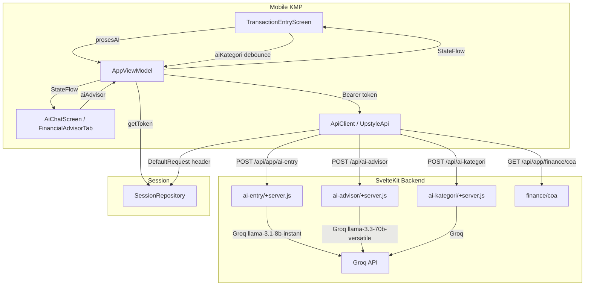

# Design Document: Mobile AI Feature

## Overview

Spec ini mengimplementasikan tiga kapabilitas AI web ke mobile KMP (Kotlin/Compose Multiplatform):

1. **Auth Fix** — memastikan Bearer token dikirim pada setiap request dan 401 dihandle dengan redirect ke LoginScreen.
2. **NLP Transaction Entry** — layar entri transaksi baru dengan field teks natural language yang memanggil endpoint `/api/app/ai-entry` baru di backend SvelteKit.
3. **AI Kategori Suggestion** — debounce flow di AppViewModel yang menyarankan kategori ABC saat user mengetik keterangan.
4. **Financial Advisor Fix** — `FinancialAdvisorTab` terhubung ke `POST /api/ai-advisor` dengan hasil ditampilkan langsung (bukan redirect ke Chat).
5. **COA Data Flow** — load dan cache COA di AppViewModel untuk mendukung form transaksi double-entry.

Bahasa implementasi: **Kotlin** (KMP shared module) + **JavaScript** (SvelteKit backend).

---

## Architecture



**Keputusan arsitektur kunci:**
- `ApiClient` sudah menggunakan `DefaultRequest` plugin Ktor — token dibaca saat *client dibuat*. Masalah: jika token baru di-save *setelah* client pertama kali dibuat, header tidak diperbarui. Solusi: inject `SessionRepository` ke `UpstyleApi` dan recreate client (atau gunakan lazy token provider) setelah login.
- `AppViewModel` menjadi satu-satunya sumber kebenaran untuk semua AI state. Tidak ada state lokal yang tersimpan di composable.
- Debounce AI-kategori diimplementasikan menggunakan Kotlin `Flow.debounce` di dalam `AppViewModel`, bukan di UI.

---

## Components and Interfaces

### 1. ApiClient Fix — Token Refresh

**File:** `shared/src/commonMain/kotlin/com/upstyle/bizgrow/api/ApiClient.kt`

`createHttpClient` sudah membaca token dari `session.getToken()` di `DefaultRequest`. Ini bekerja saat client dibuat. Masalah terjadi jika `createHttpClient` dipanggil *sebelum* login (token null), lalu login berhasil tapi client lama masih dipakai.

**Solusi:** `AppViewModel` (atau DI container) harus memanggil ulang `createHttpClient(session)` dan memperbarui instance `UpstyleApi` setelah token baru tersimpan. Karena DI setup ada di `BizgrowApp.kt`/platform-specific, tambahkan fungsi `refreshApiClient()` ke `AppViewModel` yang dipanggil setelah `session.saveSession()` berhasil.

**401 Handling:** Tambahkan `HttpResponseValidator` ke `createHttpClient` untuk menangkap response 401 dan mengirim sinyal ke ViewModel melalui `SharedFlow<AuthEvent>`.

### 2. Backend Endpoint: `POST /api/app/ai-entry`

**File baru:** `web/src/routes/api/app/ai-entry/+server.js`

```
Request:
  Authorization: Bearer {token}
  Content-Type: application/json
  Body: { unitId: number, teksInput: string }

Response (sukses):
  {
    "success": true,
    "data": {
      "hasil": {
        "product_id": string | null,
        "qty": number,
        "kategori": "Masuk" | "Keluar",
        "coa_id": number | null,
        "kas_coa_id": number | null,
        "nominal": number,
        "catatan": string
      }
    }
  }

Response (error):
  422 — teksInput kurang dari 5 karakter
  404 — unitId tidak ditemukan / bukan milik user
  401 — tidak ada Bearer token
  500 — Groq API gagal
```

Implementasi memanggil Groq dengan model `llama-3.1-8b-instant`, system prompt menyertakan daftar produk dan COA unit, user prompt adalah `teksInput`. Response di-parse ke JSON terstruktur menggunakan `response_format: { type: "json_object" }`.

Autentikasi menggunakan `getCurrentUserId(cookies, request)` — sama dengan endpoint AI lainnya (mendukung Bearer token via `Authorization` header).

### 3. AppViewModel Extensions

**File:** `shared/src/commonMain/kotlin/com/upstyle/bizgrow/ui/AppViewModel.kt`

State flows baru yang ditambahkan:

```kotlin
// COA
private val _chartOfAccounts: sudah ada — perlu ditambah hasCoa
val hasCoa: StateFlow<Boolean>  // = _chartOfAccounts.map { it.isNotEmpty() }

// Kas accounts (derived dari COA)
val kasAccounts: StateFlow<List<ChartOfAccount>>  // filter ASET_LANCAR + kas/bank/transfer

// AI Entry
private val _isAiEntryLoading = MutableStateFlow(false)
val isAiEntryLoading: StateFlow<Boolean>

private val _aiEntryResult = MutableStateFlow<AiEntryResult?>(null)
val aiEntryResult: StateFlow<AiEntryResult?>

// AI Kategori suggestion
private val _aiKategoriSuggestion = MutableStateFlow<AiKategoriResult?>(null)
val aiKategoriSuggestion: StateFlow<AiKategoriResult?>

// AI Advisor (persistent dalam sesi)
private val _aiAdvisorResult = MutableStateFlow<String?>(null)
val aiAdvisorResult: StateFlow<String?>

private val _isAiAdvisorLoading = MutableStateFlow(false)
val isAiAdvisorLoading: StateFlow<Boolean>

// Auth event untuk handle 401
private val _authEvent = MutableSharedFlow<Unit>()
val authEvent: SharedFlow<Unit>
```

Fungsi baru:

```kotlin
fun refreshApiClient() // recreate UpstyleApi dengan token terbaru
fun loadChartOfAccountsForUnit(unitId: Int)  // dipanggil otomatis saat selectUnit
fun prosesAI(teksInput: String)              // panggil /api/app/ai-entry
fun aiKategoriDebounce(teks: String)         // trigger debounce flow
fun aiAdvisor(question: String)              // panggil /api/ai-advisor
fun clearAiAdvisorResult()                   // reset saat ganti unit
```

`selectUnit()` harus diperluas untuk juga:
- Memanggil `loadChartOfAccounts(unitId)` 
- Mengosongkan `_aiAdvisorResult`

### 4. Data Models Baru

**File:** `shared/src/commonMain/kotlin/com/upstyle/bizgrow/data/Models.kt`

```kotlin
@Serializable
data class AiEntryRequest(
    val unitId: Int,
    val teksInput: String
)

@Serializable
data class AiEntryHasil(
    val product_id: String? = null,
    val qty: Int = 1,
    val kategori: String = "Masuk",  // "Masuk" | "Keluar"
    val coa_id: Int? = null,
    val kas_coa_id: Int? = null,
    val nominal: Double = 0.0,
    val catatan: String = ""
)

@Serializable
data class AiEntryData(val hasil: AiEntryHasil)

// Alias untuk StateFlow — hasil yang sudah diproses ke dalam UI
data class AiEntryResult(
    val productId: String? = null,
    val qty: Int = 1,
    val kategori: String = "Masuk",
    val coaId: Int? = null,
    val kasCoaId: Int? = null,
    val nominal: Double = 0.0,
    val catatan: String = ""
)

@Serializable
data class AiKategoriRequest(
    val teks: String,
    val unitId: Int
)

@Serializable
data class AiKategoriResult(
    val abc_id: Int? = null,
    val confidence: Int = 0,
    val reason: String = ""
)
```

Tambahkan ke `UpstyleApi.kt`:

```kotlin
suspend fun aiEntry(req: AiEntryRequest): ApiResponse<AiEntryData> =
    client.post("api/app/ai-entry") { setBody(req) }.body()

suspend fun aiKategori(req: AiKategoriRequest): ApiResponse<AiKategoriResult> =
    client.post("api/ai-kategori") { setBody(req) }.body()
```

### 5. TransactionEntryScreen

**File baru:** `shared/src/commonMain/kotlin/com/upstyle/bizgrow/ui/screens/TransactionEntryScreen.kt`

Layar ini menggantikan dialog sederhana di `FinanceScreen`. Dibuka sebagai full-screen composable melalui `Screen.TransactionEntry`.

**Layout struktur:**

```
TransactionEntryScreen
├── TopAppBar ("Entri Transaksi")
├── Column (scrollable)
│   ├── NLP Input Card
│   │   ├── OutlinedTextField (placeholder: "Ketik transaksi... (contoh: jual kopi 3 cup)")
│   │   └── Button("Proses AI") — loading state saat isAiEntryLoading
│   │
│   ├── [AI Kategori Chip — tampil jika confidence >= 60]
│   │   └── SuggestionChip(label = kategoriNama, trailingIcon = "reason")
│   │
│   ├── Form Fields Card
│   │   ├── DropdownMenu: Tipe (Masuk/Keluar)
│   │   ├── DropdownMenu: COA (difilter berdasarkan tipe)
│   │   ├── DropdownMenu: Akun Kas (filter ASET_LANCAR)
│   │   ├── DropdownMenu: Produk (optional)
│   │   ├── TextField: Qty
│   │   ├── TextField: Nominal (auto-fill dari produk atau AI)
│   │   └── TextField: Keterangan (trigger AI kategori debounce)
│   │
│   └── [No COA Warning — tampil jika hasCoa == false]
│       └── Button("Setup COA") → navigate(Screen.Coa)
│
└── Button("Simpan Transaksi") — disabled jika validasi gagal
```

**State management:** Semua form state lokal (`remember`) di composable, AI fills via `LaunchedEffect` yang observe `aiEntryResult`.

### 6. FinancialAdvisorTab Fix

**File:** `shared/src/commonMain/kotlin/com/upstyle/bizgrow/ui/screens/AiChatScreen.kt`

Perubahan pada `FinancialAdvisorTab`:
- Tambahkan `var customQuestion by remember { mutableStateOf("") }` field
- Tombol "Analisis Sekarang" memanggil `viewModel.aiAdvisor(customQuestion.ifBlank { "Analisis keuangan bisnis saya..." })`
- Tampilkan hasil dari `viewModel.aiAdvisorResult.collectAsState()` secara langsung di layar (bukan redirect ke Chat tab)
- Loading state dari `viewModel.isAiAdvisorLoading.collectAsState()`
- Guard: jika `activeUnitId == 0`, tampilkan pesan "Pilih unit bisnis terlebih dahulu" dan disable tombol

---

## Data Models

### Request/Response Flow: AI Entry

```
Mobile → POST /api/app/ai-entry
  { "unitId": 12, "teksInput": "jual ayam geprek 3 porsi" }

Backend → Groq (llama-3.1-8b-instant)
  system: "Kamu adalah parser transaksi. Daftar produk: [...]. Daftar COA: [...]."
  user: "jual ayam geprek 3 porsi"

Groq → JSON
  { "product_id": "prod-123", "qty": 3, "kategori": "Masuk", 
    "coa_id": 5, "kas_coa_id": 2, "nominal": 75000, "catatan": "Penjualan ayam geprek" }

Backend → Mobile
  { "success": true, "data": { "hasil": { ...fields... } } }

Mobile (AppViewModel)
  _aiEntryResult.value = AiEntryResult(...)

TransactionEntryScreen (LaunchedEffect)
  Form fields auto-filled, snackbar "AI Sinkron!"
```

### COA Tipe Mapping

| Tipe Transaksi | COA yang ditampilkan |
|---|---|
| Masuk | `PENDAPATAN`, `PENDAPATAN_LAINNYA` |
| Keluar | `BEBAN_OPERASIONAL`, `BEBAN_LAINNYA`, `HPP` |
| Kas/Bayar | `ASET_LANCAR` + nama mengandung "kas"/"bank"/"transfer" |

### AI Advisor State Lifecycle

```
Unit A dipilih → _aiAdvisorResult = null
User tekan "Analisis" → _isAiAdvisorLoading = true → POST /api/ai-advisor
Response sukses → _aiAdvisorResult = analysis string, _isAiAdvisorLoading = false
User berpindah tab → hasil tetap (tidak di-reset)
User kembali → hasil masih tampil (tanpa API call ulang)
User ganti unit → _aiAdvisorResult = null (di selectUnit())
```

---

## Correctness Properties

Fitur ini melibatkan UI rendering, side effects API, dan state management — bukan pure functions dengan input/output yang dapat diuji secara universal. Property-based testing tidak sesuai di sini karena:

- Komponen utama adalah API calls ke Groq (eksternal), Compose UI rendering, dan StateFlow wiring
- Tidak ada transformasi data murni yang memiliki universal properties yang berarti
- Testing AWS/external service (Groq) sebaiknya menggunakan integration tests

Oleh karena itu, **Correctness Properties section dihilangkan** dan digantikan dengan unit tests dan integration tests yang terstruktur.

---

## Error Handling

| Skenario | Penanganan |
|---|---|
| `getToken()` null saat app dibuka | `App.kt` redirect ke `LoginScreen` |
| HTTP 401 dari backend | `AppViewModel._authEvent` emit → `App.kt` navigasi ke Login + `session.clearSession()` |
| `aiEntry` gagal (jaringan) | `_uiState.error` diset, form state tidak berubah |
| `aiEntry` gagal (Groq 500) | Error message informatif, user bisa retry |
| `aiAdvisor` gagal | Pesan error + tombol "Coba Lagi" |
| `aiKategori` gagal | Diam (tidak tampilkan chip), tidak interrupt user |
| COA belum di-setup | Banner informatif + tombol navigasi ke CoaScreen |
| `unitId == 0` | Semua AI buttons disabled dengan pesan "Pilih unit bisnis" |

---

## Testing Strategy

### Unit Tests (Example-based)

**AppViewModel:**
- `selectUnit(id)` harus mengosongkan `_aiAdvisorResult` dan memuat COA
- `prosesAI("")` tidak boleh memanggil API (teks terlalu pendek)
- `aiAdvisor(question)` dengan `activeUnitId == 0` tidak boleh memanggil API

**Data Models:**
- `AiEntryResult` mapping dari `AiEntryHasil` response
- COA filter logic (tipe mapping per kategori transaksi)

**Backend `/api/app/ai-entry`:**
- 422 jika `teksInput.length < 5`
- 404 jika `unitId` tidak milik user
- 401 jika tidak ada Bearer token

### Integration Tests

**End-to-end flows (1-3 contoh per flow):**
- Login → token tersimpan → request berikutnya mengandung `Authorization: Bearer` header
- Ketik teks → tekan "Proses AI" → form terisi otomatis
- Ganti unit → `_aiAdvisorResult` di-reset → analisis lama tidak tampil

### Manual / UI Tests

- TransactionEntryScreen: COA dropdown menampilkan akun yang tepat sesuai tipe Masuk/Keluar
- AI Kategori chip hanya muncul jika confidence ≥ 60
- Snackbar "AI Sinkron!" muncul setelah form terisi
- Loading indicator pada tombol "Proses AI" selama request berjalan
